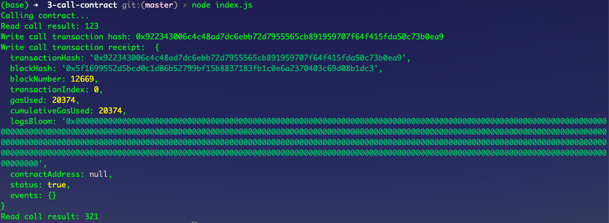

# Gitcoin: 3) Issue A Smart Contract Call To The Deployed Smart Contract

## 1. Screenshot of the console output



## 2. Transaction hash

0x922343006c4c48ad7dc6ebb72d7955565cb891959707f64f415fda50c73b0ea9

## 3. Contract address

0x030E0873446Ff68eEa10a58b51a08ECA1270Fed7

## 4. ABI

```json
[
    {
        "inputs": [],
        "stateMutability": "payable",
        "type": "constructor"
    },
    {
        "inputs": [],
        "name": "get",
        "outputs": [
            {
                "internalType": "uint256",
                "name": "",
                "type": "uint256"
            }
        ],
        "stateMutability": "view",
        "type": "function"
    },
    {
        "inputs": [
            {
                "internalType": "uint256",
                "name": "x",
                "type": "uint256"
            }
        ],
        "name": "set",
        "outputs": [],
        "stateMutability": "payable",
        "type": "function"
    }
];
```
